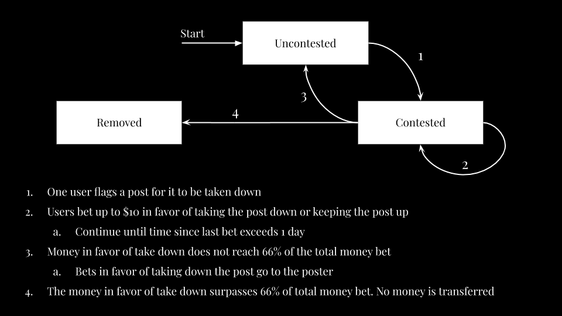

# Anonym
An anonymous, decentralized blogging platform powered by the blockchain through the [Blockstack API](https://blockstack.org/) and React.JS 

Built during OpenHacks 2020. Checkout our [DevPost](https://devpost.com/software/open-hacks) for a Demo!
## Motivation
Freedom of speech is a bastion of American society. However, it is not always clear what delineates hateful speech from simply a controversial opinion. As a result, many people choose not to speak their mind for fear of being shouted down or derided. Anonym aims to provide a free space where users can speak their ideas freely in complete anonymity. It is a blogging platform which helps ideas surface by removing the fear of retribution, allowing for everyone's open contribution to democratic society and continuing the tradition of a society of free and independent thinkers.

However, such an anonymous space is also a prime location for hateful and violent speech. Such speech does not contribute to thoughtful discussion and is harmful to our democracy. Many tech companies are currently under fire for their content moderation practices. This is why we built a novel content moderation scheme which leverages the principles of the market to weed out hateful and violent speech while leaving controverial opinions untouched.

## What it does
Users log in anonymously via Blockstack. They are in complete control of their data because there is no central server which stores their identity or information. Everything outside of their posts is encrypted. See the [content moderation](#content-moderation) section to learn how it works

## How we built it
We used BlockStack's Gaia storage system to store the posts and comments, along with React JS as the web framework with the Ant Design UI kit. We also used Heroku to deploy the default Blockstack Radiks server to faciliate interactions with the Gaia Storage system. The front-end is hosted on Github Pages.

## Content Moderation
This is a state diagram of each Post

In designing the content moderation scheme, these were the considerations:
1. Users should be as anonymous as possible
    -  Their only identification is their BCH Wallet
2. Odious content should be removed
    - A supermajority in favor of taking down the post will be reached easily
3. Contentious topics should not be taken down frivolously
    - A supermajority must be reached to take down a post
    - Users assign a dollar value proportional to their feelings
4. Each user’s opinion has equal weight
    - There is a cap on the number of amount of BCH that can be bet (approx $10 U.S.D)
    - Users can only contest a post once
5. Organized individuals cannot sway whether or not a post is taken down
    - Contestation ends when the last bet was placed over 1 day ago

## Installation Guide
1. Install MongoDB
2. Start Mongo
3. `$ mongo`
4. `> use anonym`
5. `> db.createUser({user: "admin", pwd:"open-hacks",roles: ["readWrite","dbAdmin"]});`
6. `$ npm install -g radiks-server`
7. `$ npm install`

## Startup Guide
1. Load the radiks environment file
2. `$ radiks-server`
3. `$ npm run start`

## Creators
- Anmol Parande
- Roshan Kumaraswamy
- Rohil Tuli
- Rahul Dani
